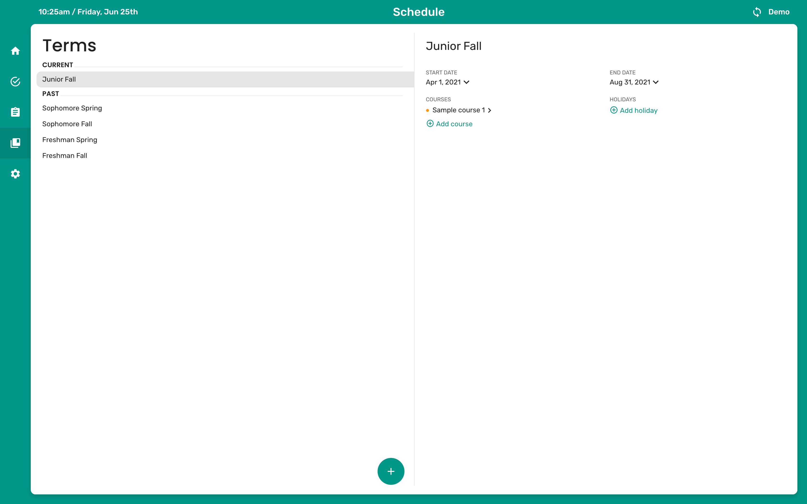
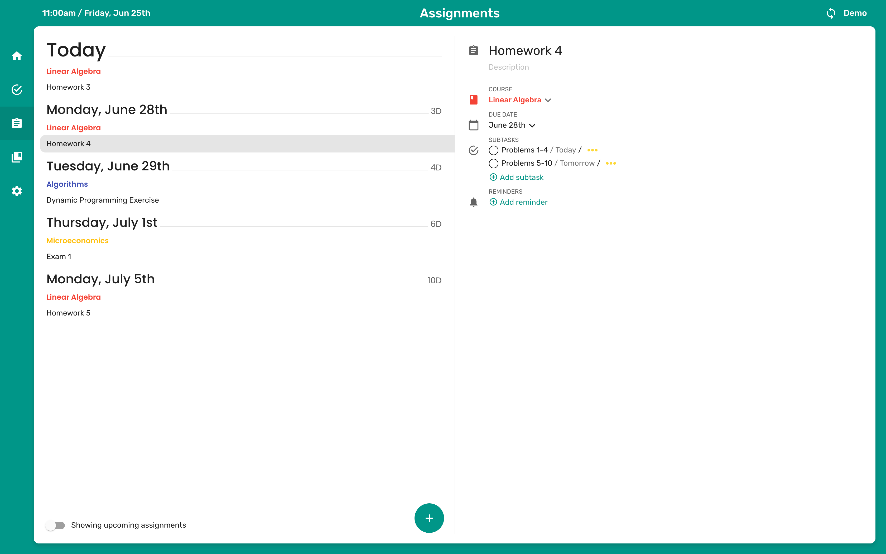
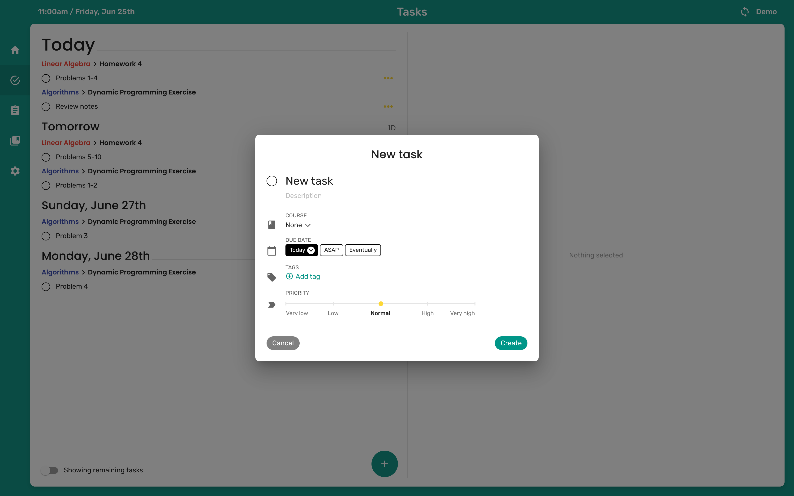
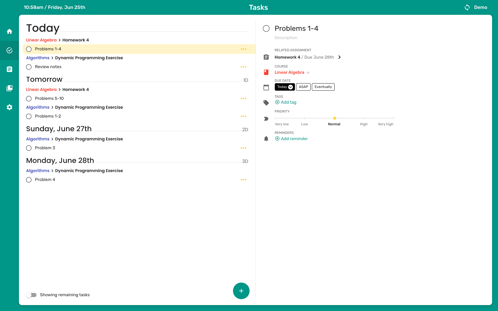
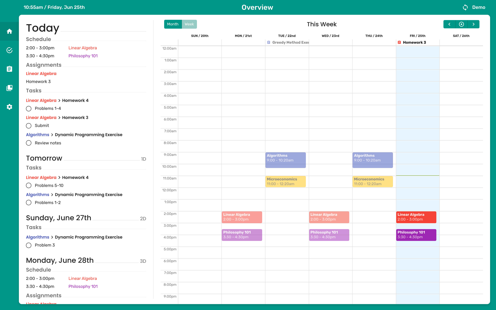
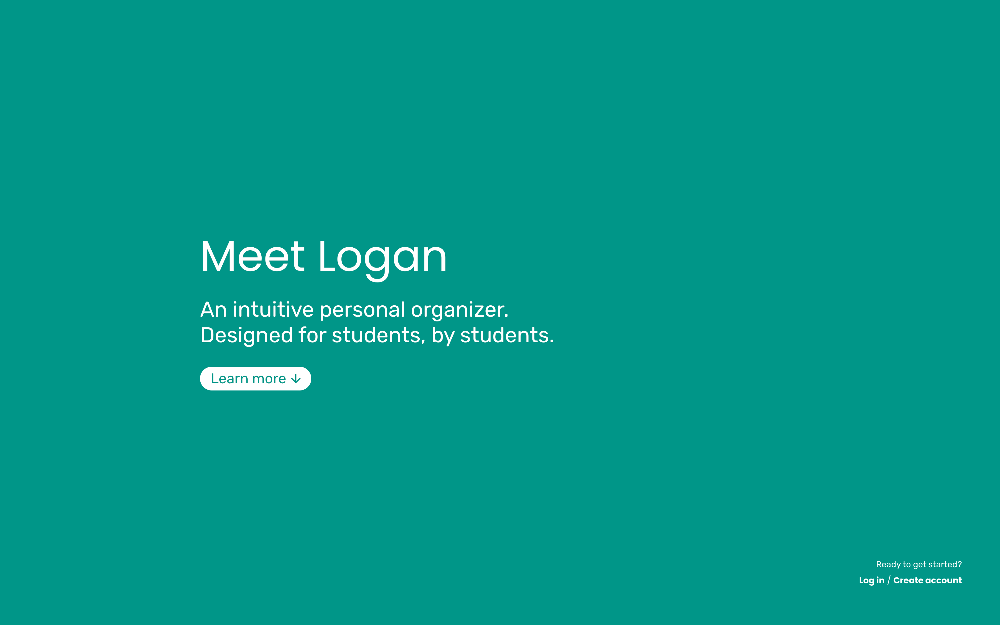
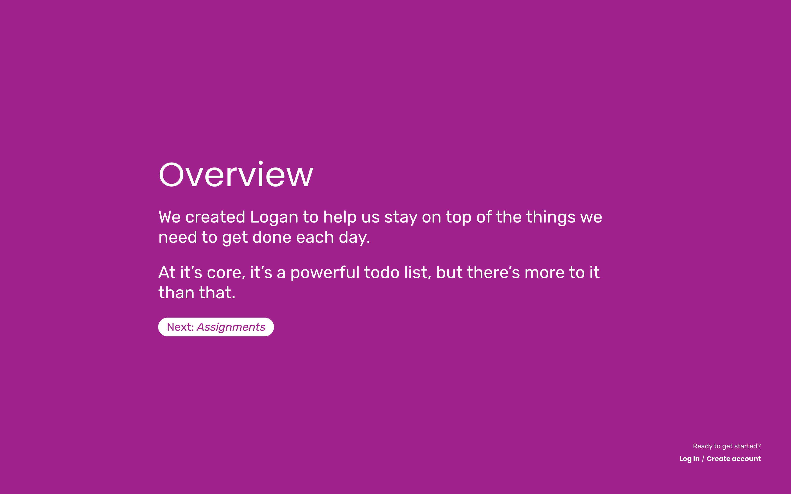

# Logan

A personal organizer designed for college students.

Logan is the capstone project for Lucas Popp, Adam Stewart, Jimmy Zassick, and Prem Rao.

Logan is a planner for students. Students can create "terms", or semesters, associate courses with those terms, create assignments, and divide assignments into tasks, all to aide with organization and productivity!

> Talk about structure/pages

## Terms and Courses



The terms page is shown above. Terms are given start and end dates, and associated courses automatically end when the term ends. Courses are color coded, and contain relevant information (like start and end time). Holidays can also be added to terms, and courses are automatically removed from those days (see [Overview](#overview)).

## Assignments and Tasks
Assignments are exactly what they sound like: assignments! Students can create assignments, associate them with a course, assign a due date, and create tasks and reminders.



Tasks are intended to break up assignments into more manageable pieces. Tasks have due dates and descriptions, but also have priority levels. While most tasks are associated with assignments, they do not need to be. Creating new tasks is quick and easy, and helps encourage steady progress on an assignment.



> Put these images side by side?



## Overview



## Landing Page and Sign In





## Mobile Interface

## URLs

Frontend: http://logan-frontend.s3-website-us-west-2.amazonaws.com

Backend: http://logan-backend-dev.us-west-2.elasticbeanstalk.com

## Setup

Install lerna globally: `npm i -g lerna`

## Deployment

```bash
# Deploy backend
npm run deploy:backend

# Deploy frontend
npm run deploy:frontend

# If these commands don't work, run the following command and try again
chmod u+x scripts/deploy-<service>.sh
```

## Development Instructions

### Node Modules

Clean node modules: `npm run clean-all`

Reinstall node modules: `npm run bootstrap`

Bootstrap for production: `npm run bootstrap:production`

### Package Installation/Uninstallation

Install a package _globally:_ `npm i <pkg> --save` or `npm i <pkg> --save-dev`

Install a package in a specific module: `lerna add --scope <internal pkg> <package to install> [--dev] --no-bootstrap`

*Note: Installing something with the `--dev` flag will make it not be included for deployment (i.e. it's only used in development)*

To uninstall a package, delete it from the module's `package.json` then clean and rebootstrap.

## Resources

Lerna Documentation: https://github.com/lerna/lerna

Specific Lerna commands:
- [@lerna/add](https://github.com/lerna/lerna/tree/master/commands/add#readme) - Add a dependency
- [@lerna/bootstrap](https://github.com/lerna/lerna/tree/master/commands/bootstrap#readme) - Basically, install node modules
- [@lerna/clean](https://github.com/lerna/lerna/tree/master/commands/clean#readme) - Clean node_modules
- [@lerna/create](https://github.com/lerna/lerna/tree/master/commands/create#readme) - Create a private package
